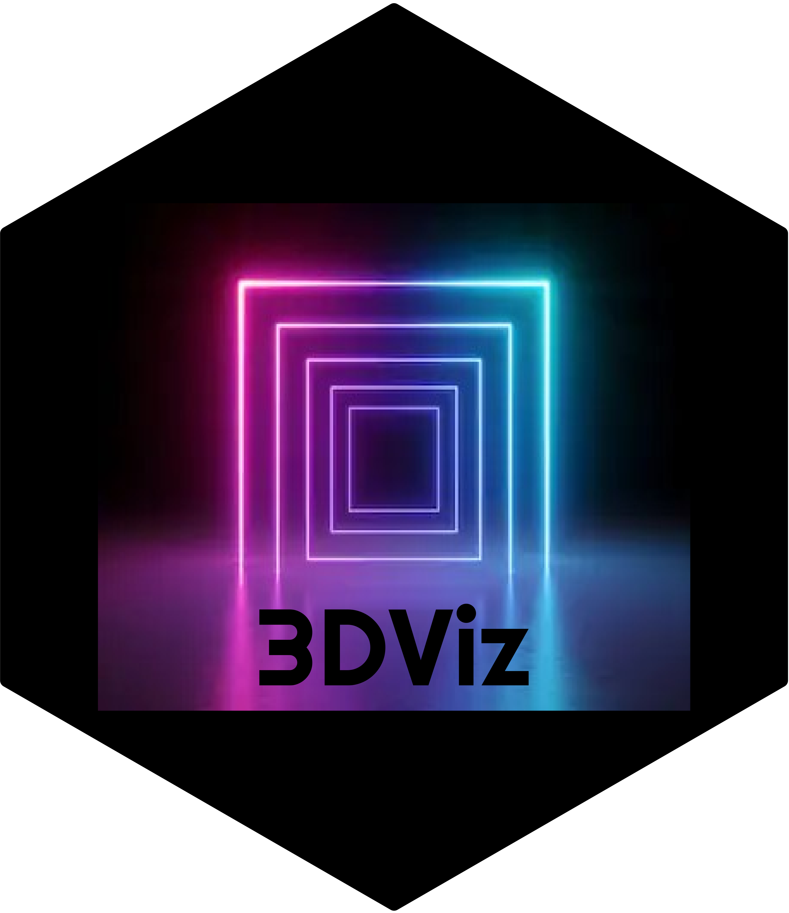

# Summary

3DViz is a 3D/4D visualization dashboard, written in
[R 3.6.2](https://cran.r-project.org/bin/windows/base/old/3.6.2/) with a
[Shiny](https://shiny.rstudio.com/) backend, that produces publishable
high-dimensional figures. 3DViz is pre-packaged with a complete
computational engine. As such, 3DViz can be downloaded, configured, and
launched utilizing an end-user’s local system as its server.

# Download/Configure

3DViz can be downloaded from its
[Github](https://github.com/ryEllison/3DViz) repo. Once downloaded, the
**config.bat** executable should be launched to ensure proper backend
configuration on the user’s local system before use. 3DViz configuration
is only needed once.

# Use

After 3DViz configuration, the application can be launched and used as
follows:

1.  Launch via the **\_init\_.bat** executable
    
      - A terminal will open indicating the creation of a local server

2.  After the server is created, an internet browser (e.g., Chrome or
    Firefox) should be opened

3.  **localhost:3838** should be entered as a web address
    
      - This will launch a local version of the Shiny dashboard

4.  A file browser will appear, and the user can navigate to and select
    a **\*.csv** dataset
    
      - The data file should be structured such that each column
        represents a vector of data (datasets meant for testing purposes
        can be referred to as examples)

5.  Once a dataset is selected, 3DViz will load in the data and open
    
      - User controls can be manipulated to select vectors of data to
        plot, alter characteristics of the plot, and export different
        versions as pdf files

# Test

When 3DViz is launched (see **Use**), a file browser will appear. Inside
the file browser should be a **data** directory in which are three toy
datasets. The user should select one of these datasets, plot the data,
and export the figure as a test of proper configuration of the Shiny
dashboard.
